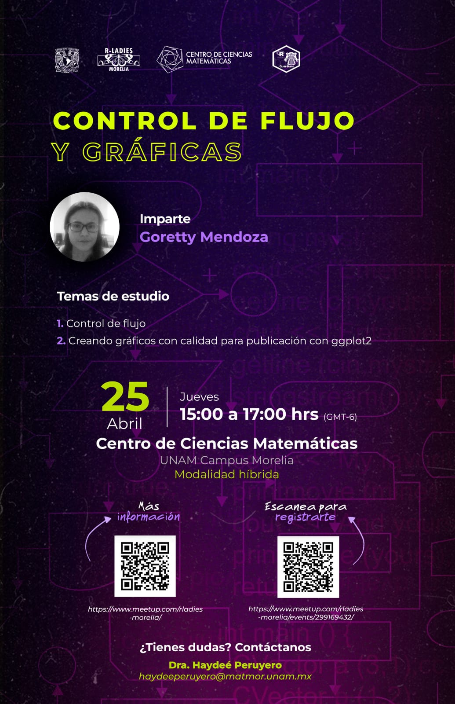
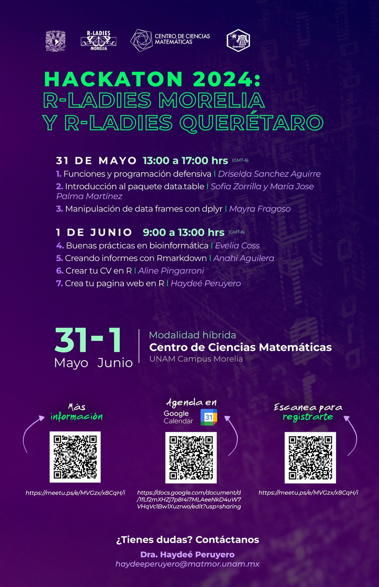

# R para Análisis Científicos Reproducibles

Colaboración R-Ladies Morelia y R-Ladies Queretaro, Feb - Junio 2024.

Se emplearon los cursos impartidos por The Carpentries, empleando el tema [R para Análisis Científicos Reproducibles](https://swcarpentry.github.io/r-novice-gapminder-es/) de Software Carpentries en su versión en español. 

## Contenido

### Reunión 1

- Fecha: jueves 29 de febrero 2024
- Horario: 15 - 17 h (hora Ciudad de Mexico)
- Responsable: R-Ladies Morelia
- Instructoras: Karina Verdel Aranda y Quetzali Medina
- Temas: 
  - 1) [Introducción a R y RStudio](https://swcarpentry.github.io/r-novice-gapminder-es/01-rstudio-intro.html)       
  - 2) [Gestión de proyectos con RStudio](https://swcarpentry.github.io/r-novice-gapminder-es/02-project-intro.html)
  - 3) [Buscando ayuda](https://swcarpentry.github.io/r-novice-gapminder-es/03-seeking-help.html)
  - 4) [Estructuras de datos](https://swcarpentry.github.io/r-novice-gapminder-es/04-data-structures-part1.html)

### Reunión 2 (Cancelada)

- Fecha: jueves 21 de marzo 2024
- Horario: 15 - 17 h (hora Ciudad de Mexico)
- Responsable: R-Ladies Querétaro
- Instructora: Karen Nuñez
- Temas:
  - 5) [Explorando data frames](https://swcarpentry.github.io/r-novice-gapminder-es/05-data-structures-part2.html)
  - 6) [Haciendo subconjuntos de datos](https://swcarpentry.github.io/r-novice-gapminder-es/06-data-subsetting.html)

### Reunión 3

- Fecha: jueves 25 de abril 2024
- Horario: 15 - 17 h (hora Ciudad de Mexico)
- Responsable: R-Ladies Morelia
- Instructora: Goretty Mendoza
- Temas:
  - 7) [Control de flujo](https://swcarpentry.github.io/r-novice-gapminder-es/07-control-flow.html)
  - 8) [Creando gráficas con calidad para publicación con ggplot2](https://swcarpentry.github.io/r-novice-gapminder-es/08-plot-ggplot2.html)

### Hackaton 2024

- Fecha: viernes 31 de mayo 
- Horario: 13 - 17 h (hora Ciudad de Mexico)
- Responsable: R-Ladies Querétaro y R-Ladies Morelia
- Temas:
  - Funciones y programación defensiva - Driselda Sanchez Aguirre
  - [Introducción al paquete data.table](https://github.com/sofiazorrilla/Taller_data.table) - Sofia Zorrilla y Maria Jose Palma Martinez
  - [Manipulación de data frames con dplyr](https://swcarpentry.github.io/r-novice-gapminder-es/13-dplyr.html) y [Guardando datos](https://swcarpentry.github.io/r-novice-gapminder-es/11-writing-data.html) - Mayra Fragoso

- Fecha: sábado 1 de junio 2024
- Horario: 9 - 13 h (hora Ciudad de Mexico)
- Temas:
  - Buenas prácticas en bioinformática - Evelia Coss
  - Creando informes con Rmarkdown - Anahi Aguilera
  - Crear tu CV en R - Aline Pingarroni
  - Crea tu pagina web en R - Haydee Peruyero
